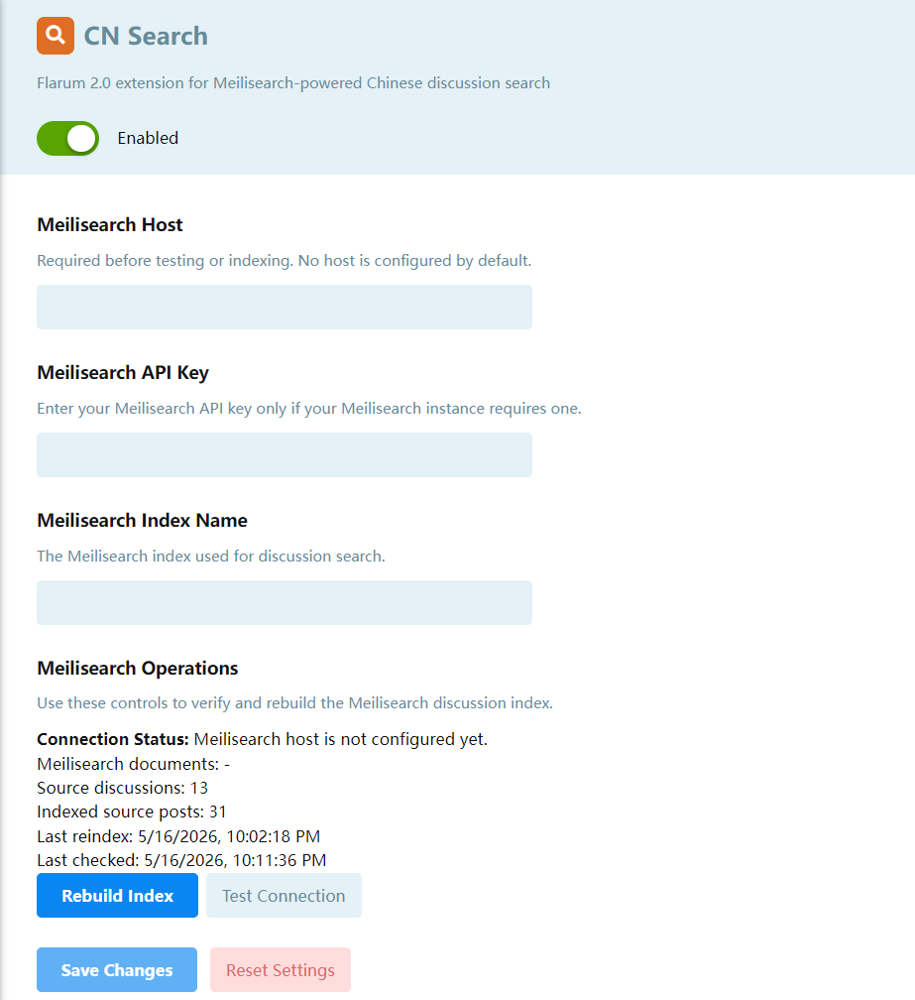
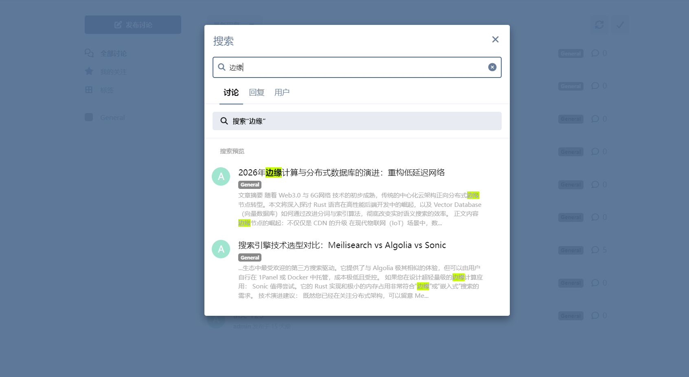

# CN Search for Flarum 2.0

`gitzaai/cnsearch` is a Flarum 2 extension that uses Meilisearch as the discussion search backend. It indexes discussion titles and visible comment content, then plugs into Flarum's built-in discussion search flow.

## Screenshots

### Admin Settings



### Search Results




## Features

- Uses Meilisearch for discussion full-text search.
- Stores one Meilisearch document per discussion.
- Merges visible comment posts into each discussion document.
- Adds CJK n-gram fields for Chinese, Japanese, Korean, and other CJK search terms.
- Lowers the forum search trigger length so 1-2 character Chinese queries can run.
- Provides admin APIs and console commands for status checks, connection tests, search tests, and reindexing.
- Syncs the index when posts or discussions are created, edited, hidden, restored, or deleted.

## Installation

```bash
composer require gitzaai/cnsearch
php flarum assets:publish
php flarum cache:clear
```

For Flarum 2.0 beta 8 and newer, run `php flarum assets:publish` after installing or updating the extension to make sure frontend assets match the current extension code.

## Configuration

The extension does not ship with a preset Meilisearch host or API key. Configure them in the admin panel, or use the bundled command:

```bash
php flarum cnsearch:configure https://your-meilisearch.example --index=flarum_discussions
php flarum cache:clear
```

If your Meilisearch instance requires authentication, provide your own key:

```bash
php flarum cnsearch:configure https://your-meilisearch.example --key=replace_with_your_key --index=flarum_discussions
php flarum cache:clear
```

You can also write the settings directly:

```sql
INSERT INTO settings (`key`, `value`) VALUES
  ('cnsearch.meili.host', 'https://your-meilisearch.example'),
  ('cnsearch.meili.index', 'flarum_discussions')
ON DUPLICATE KEY UPDATE `value` = VALUES(`value`);
```

If your Flarum database tables use a prefix, replace `settings` with the prefixed table name.

## Verification

Rebuild the index:

```bash
php flarum cnsearch:reindex
```

If Flarum reports `There are no commands defined in the "cnsearch" namespace.`, enable **CN Search** in the admin panel first, then run the command again.

Check status:

```bash
php flarum cnsearch:status
```

`Documents` is the number of indexed Meilisearch documents, which normally matches the number of visible discussions. `Source posts` is the number of visible comment posts included in the index, and can be larger than `Documents`.

Test a search term directly:

```bash
php flarum cnsearch:search 中文关键词
```

After updating the extension, these commands are useful:

```bash
composer dump-autoload -o
php flarum cache:clear
php flarum cnsearch:reindex
```

## API

Search:

```bash
curl "https://your-flarum-site.example/api/cnsearch/search?q=keyword&page=1&perPage=20"
```

Status checks and reindexing require an admin session:

```bash
curl "https://your-flarum-site.example/api/cnsearch/status"
curl -X POST "https://your-flarum-site.example/api/cnsearch/reindex"
curl "https://your-flarum-site.example/api/cnsearch/test-connection"
```

## Links

- [Packagist](https://packagist.org/packages/gitzaai/cnsearch)
- [Discuss](https://discuss.flarum.org/)
- [Report Issues](https://github.com/gitzaai/cnsearch/issues)
